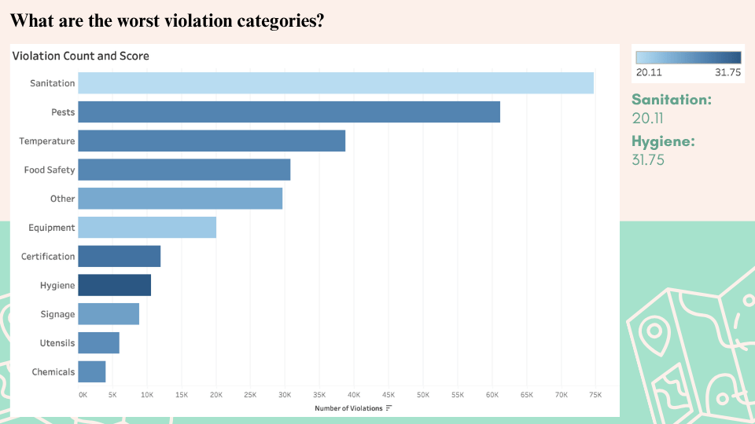
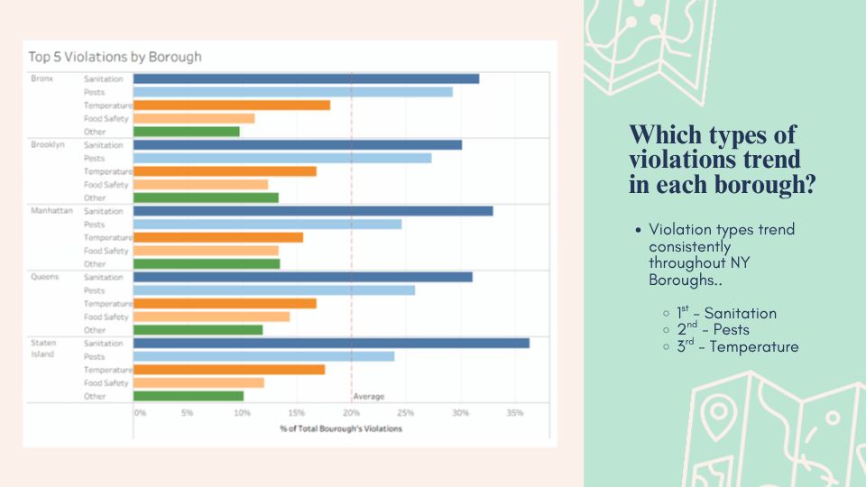
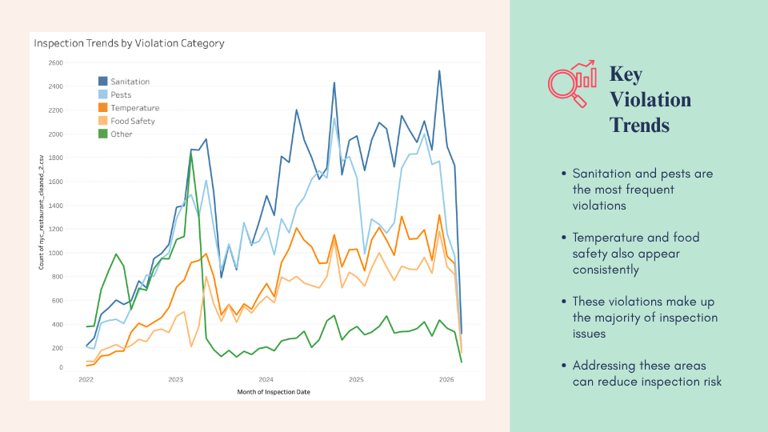

# Reducing Inspection Risk Across NYC Restaurant Operations

## Overview
Poor inspection outcomes can damage brand trust and increase operational risk. This project analyzes ~296K inspection records to reduce inspection risk, avoid grade drops, and protect brand reputation.

## Objective
Which violation patterns, cuisines, boroughs, and time periods are associated with worse inspection outcomes?

## Tools Used
- **Python** (Pandas, NumPy) for data cleaning and manipulation
- **Jupyter Notebook** for exploratory data analysis
- **Tableau** for data visualization and presentation

## Process
1. **Data Collection** – Sourced dataset from [NYC Open Data - DOHMH Restaurant Inspection Results](https://data.cityofnewyork.us/Health/DOHMH-New-York-City-Restaurant-Inspection-Results/43nn-pn8j/about_data).
2. **Data Cleaning** – Removed duplicate records and excluded irrelevant location and administrative fields.
3. **Feature Engineering** – Grouped granular violation descriptions into broader categories such as sanitation, pests, temperature, and food safety.
4. **Analysis** – Evaluated variables including borough, cuisine type, inspection date, score, grade, and violation details.

## Violation Categories & Scores

**Key Highlights:**
- The most frequent issues found are pests and poor sanitation.
- Food safety and temperature violations generate the highest penalty scores when they happen (averaging 27 to 28 points).
- Lower scores are preferred; achieving an A grade requires scoring 13 points or fewer.

## Geographical Distribution

**Key Findings:**
- Average inspection scores are surprisingly similar across all boroughs.
- The types of violations follow a consistent pattern regardless of the NY borough.
- Across the board, the top three issues remain temperature, pests, and sanitation.

## Temporal Trends

**Key Findings:**
- Inspection volumes remained relatively steady until the end of 2021.
- Starting in 2022, there was a dramatic spike in the number of inspections.
- This increased inspection volume resulted in more violations being recorded across multiple categories.

## Key Insights
- ✅ **Cuisine Predictors:** Indian, Caribbean/African, and Chinese establishments score significantly worse on average compared to Fast Food and Cafe/Bakery locations.
- ✅ **Violation Consistency:** The vast majority of inspection issues stem from food safety, temperature, pests, and sanitation.
- ✅ **Geography is Secondary:** Outcomes are predicted much more strongly by historical violation patterns and cuisine format rather than the restaurant's location.

## Conclusion & Recommendations
Inspection risks can be predicted. The organization can substantially boost its compliance culture and improve scores by prioritizing high-risk locations, conducting proactive audits, and implementing targeted training.

- **Target High-Risk Violations:** The biggest chain-wide impact comes from kitchen checklists and targeted training aimed at the most frequent issues: pests and sanitation.
- **Shift to Proactive Compliance:** The majority of city-flagged violations are operational and can be caught early. Setting up monthly internal audits using the city's official framework allows teams to resolve issues before official inspections.
- **Prioritize High-Risk Cuisines:** Allocate more compliance support and resources to higher-risk formats like Chinese, Caribbean/African, and Indian.
- **Develop an Early Warning Risk Score:** Create a system to flag underperforming restaurants early by analyzing historical repeat patterns, scores, and past violations, allowing for timely intervention.

## Deliverables
- **Jupyter Notebook** – Complete data cleaning and exploratory data analysis workflow.
- **Presentation Slides** – Executive summary, geographical visualizations, and strategic recommendations.

## Files
| File | Description |
|------|-------------|
| `Data_Cleaning_Analysis.ipynb` | Python notebook detailing the data processing, cleaning, and categorization |
| `Presentation Slides.pdf` | Executive presentation with visual insights and business recommendations |
| `images/` | Directory containing supporting visualizations used in this documentation |
| `README.md` | This documentation file |

---

**Note:** This project was completed during my Master of Science in Business Analytics program, demonstrating the application of data cleaning, exploratory analysis, and visualization to solve operational risks and protect brand reputation.
